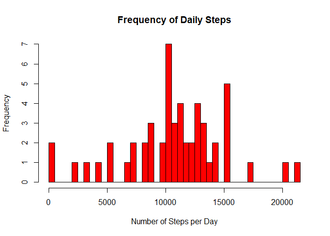
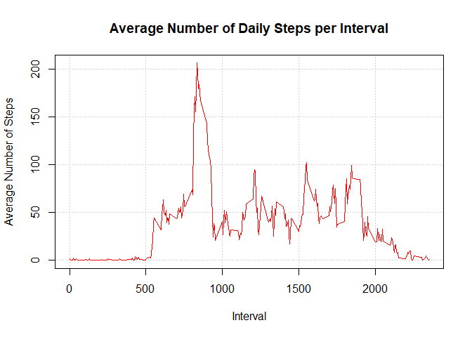
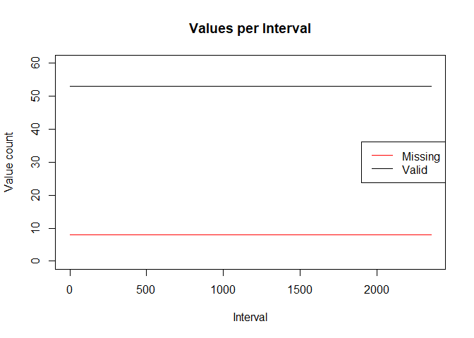
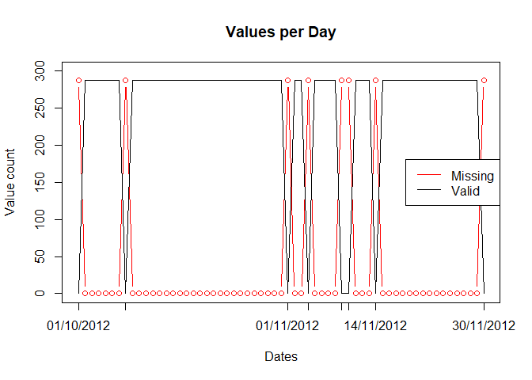
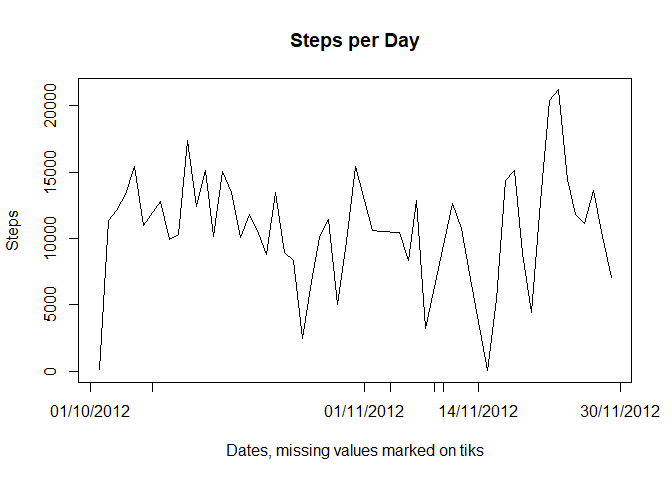
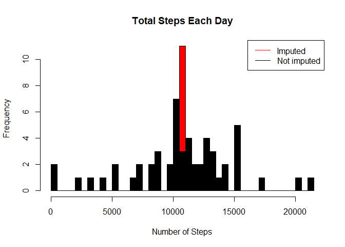
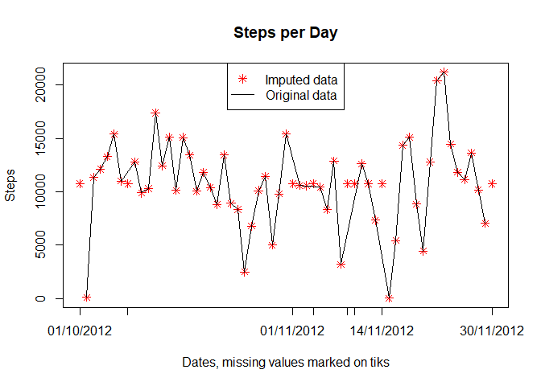
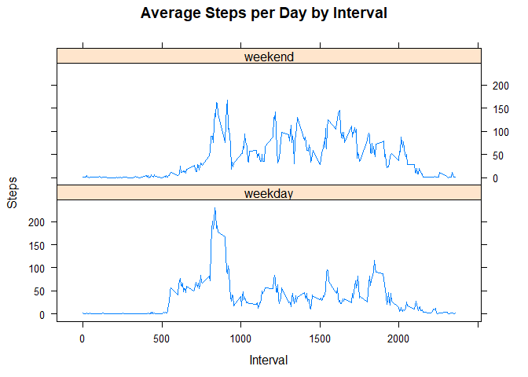

## Introduction
This project is executed within the context of the coursera course on reproducible research.
The submission criteria are presented in the next chapter.
The respective code and documentation are presented in the subsequent chapters.

## Submission Criteria 
1. Code for reading in the dataset and/or processing the data
2. Histogram of the total number of steps taken each day
3. Mean and median number of steps taken each day
4. Time series plot of the average number of steps taken
5. The 5-minute interval that, on average, contains the maximum number of steps
6. Code to describe and show a strategy for imputing missing data
7. Histogram of the total number of steps taken each day after missing values are imputed
8. Panel plot comparing the average number of steps taken per 5-minute interval across weekdays and weekends
9. All of the R code needed to reproduce the results (numbers, plots, etc.) in the report


## Implementation

### Loading and preprocessing the data
#### 1. Code for reading in the dataset and/or processing the data
Load data into data frame `activity`. 

```r
setwd("C:/GIO/PC/Rprojects/5.ReproducibleResearch/week 2")
activity <- read.csv("activity.csv")
```

### What is mean total number of steps taken per day?
#### 2. Histogram of the total number of steps taken each day
##### Distribution of daily steps

```r
steps_day <- aggregate(steps ~ date, activity, sum)
hist(steps_day$steps,  
     col="red", breaks=50,
     main = paste("Frequency of Daily Steps"),  xlab="Number of Steps per Day")
```

<!-- -->

The distribution of steps does not resemble to a known distribution at first sight. 

#### 3. Mean and median number of steps taken each day

```r
steps_day_mean <- round(mean(steps_day$steps))
steps_day_median <- round(median(steps_day$steps))

delta_steps_day_mean_median <- steps_day_mean-steps_day_median
```

The mean value of steps amounts to 1.0766\times 10^{4} while the median value amounts to 1.0765\times 10^{4}. The two values are 1 step(s) apart.

### What is the average daily activity pattern?
#### 4. Time series plot of the average number of steps taken
##### Steps-time series (interval)

```r
steps_interval_mean <- aggregate(steps ~ interval, activity, mean)

plot(steps_interval_mean$interval,steps_interval_mean$steps, 
     type="l", col="red", lwd=1.5, panel.first=grid(),
     main="Average Number of Daily Steps per Interval", xlab="Interval", ylab="Average Number of Steps")
```

<!-- -->

#### 5. The 5-minute interval that, on average, contains the maximum number of steps

```r
max_interval <- steps_interval_mean[which.max(steps_interval_mean$steps),1]
```

The 5-minute interval that, on average, contains the maximum number of steps is 835.

### Imputing missing values
#### 6. Code to describe and show a strategy for imputing missing data
First we will look at the available data and more specifically, we will try to identify patterns in the missing values.

##### Values per Interval

```r
steps_interval_cntNA <- aggregate(!complete.cases(steps) ~ interval, activity, sum)
names(steps_interval_cntNA)[2] <- "cntNA"
steps_interval_cntNA$cnt <- aggregate(complete.cases(steps) ~ interval, activity, sum)$'complete.cases(steps)'
plot(steps_interval_cntNA$interval, steps_interval_cntNA$cntNA, 
     type="l", ylim = c(0, 60), col="red",
     main="Values per Interval", xlab="Interval", ylab="Value count")
lines(steps_interval_cntNA$interval, steps_interval_cntNA$cnt,
      col="black")
legend("right", c("Missing", "Valid"), col=c("red", "black"), lty = 1:1)
```

<!-- -->

* There are 8 values missing and 53 values available per interval over all intervals. 

##### Values per Day

```r
steps_day_cntNA <- aggregate(!complete.cases(steps) ~ date, activity, sum)
names(steps_day_cntNA)[2] <- "cntNA"
steps_day_cntNA$cnt <- aggregate(complete.cases(steps) ~ date, activity, sum)$'complete.cases(steps)'
steps_day_cntNA$date <- as.Date(steps_day_cntNA$date,format="%Y-%m-%d")
plot(steps_day_cntNA$date, steps_day_cntNA$cntNA, 
     type="b", xaxt="n", ylim = c(0, 300), col="red",
     main="Values per Day", xlab="Dates", ylab="Value count")
axis.Date(1,at=steps_day_cntNA$date[which(steps_day_cntNA$cntNA>0)], format="%d/%m/%Y")
lines(steps_day_cntNA$date, steps_day_cntNA$cnt,
      col="black")
legend("right", c("Missing", "Valid"), col=c("red", "black"), lty = 1:1)
```

<!-- -->

* There are 253 values missing (all) for 8 dates out of all dates.

##### Steps-time series (day)

```r
steps_day$date <- as.Date(steps_day$date,format="%Y-%m-%d")
plot(steps_day$date, steps_day$steps,
     type="l", col="black", xaxt="n",
     main="Steps per Day", xlab="Dates, missing values marked on tiks", ylab="Steps")
axis.Date(1,at=steps_day_cntNA$date[which(steps_day_cntNA$cntNA>0)], format="%d/%m/%Y")
```

<!-- -->

* The amount of steps seem to depend stronger on the interval than on the specific date. (considering also the previous chart "steps-time series (interval)")

A simple imputing technique would thus be to impute the missing values with the average over the interval.


```r
activity_im <- activity
activity_im$steps <- ifelse(is.na(activity$steps), steps_interval_mean$steps[match(activity$interval, steps_interval_mean$interval)], activity$steps)
```

#### 7. Histogram of the total number of steps taken each day after missing values are imputed

##### Distribution of steps with and without imputed values

```r
steps_day_imputed <- aggregate(steps ~ date, activity_im, sum)
hist(steps_day_imputed$steps, 
     col="red", breaks = 50,
     main = paste("Total Steps Each Day"), xlab="Number of Steps")

hist(steps_day$steps, add=T,
     col="black", breaks = 50,
     main = paste("Total Steps Each Day"),  xlab="Number of Steps")
legend("topright", c("Imputed", "Not imputed"), col=c("red", "black"), lty=1:1)
```

<!-- -->

##### Imputed steps per day

```r
steps_day_imputed$date <- as.Date(steps_day_imputed$date,format="%Y-%m-%d")
plot(steps_day_imputed$date, steps_day_imputed$steps,
     col="red", xaxt="n", pch=8,
     main="Steps per Day", xlab="Dates, missing values marked on tiks", ylab="Steps")
axis.Date(1,at=steps_day_cntNA$date[which(steps_day_cntNA$cntNA>0)], format="%d/%m/%Y")
lines(steps_day$date, steps_day$steps)
legend("top", c("Imputed data", "Original data"), col=c("red", "black"), pch=c(8,-1), lwd=c(-1,1))
```

<!-- -->

#### Mean and median number of steps taken each day

```r
steps_day_imputed_mean <- round(mean(steps_day_imputed$steps))
steps_day_imputed_median <- round(median(steps_day_imputed$steps))
```
and the difference to the original data amounts to

```r
delta_steps_day_mean <-  steps_day_imputed_mean-steps_day_mean
delta_steps_day_median <- steps_day_imputed_median-steps_day_median
```

The mean value of steps amounts to 1.0766\times 10^{4} which is a delta of 0 from the non-imputed data, while the median value amounts to 1.0766\times 10^{4} which is a delta of 1 from the non-imputed data.

By imputing with mean values, we do not introduce any changes to the mean, which is to be expected. The median remains also almost identical since it was very similar in the first place.

#### Total steps

```r
steps_day_imputed_sum <- sum(steps_day_imputed$steps)
steps_day_sum <- sum(steps_day$steps)
delta_steps_day_sum <- steps_day_imputed_sum-steps_day_sum
```
The total steps taken in the original data set were 570608 while the steps in the imputed data set are 6.5673751\times 10^{5}, which is a delta of 8.6129509\times 10^{4}. The delta is significant.

### Are there differences in activity patterns between weekdays and weekends?
#### 8. Panel plot comparing the average number of steps taken per 5-minute interval across weekdays and weekends

```r
library(lattice)

activity_im$day <- weekdays(as.Date(activity_im$date, format="%Y-%m-%d"))
activity_im$daytype <- ifelse(activity_im$day %in% c('Montag', 'Dienstag', 'Mittwoch', 'Donnerstag', 'Freitag'), 'weekday', 'weekend')

steps_interval_daytype <- aggregate(steps ~ interval + daytype, activity_im, mean)

xyplot(steps_interval_daytype$steps ~ steps_interval_daytype$interval|steps_interval_daytype$daytype,
       layout=c(1,2), type="l",
       main="Average Steps per Day by Interval",xlab="Interval", ylab="Steps")
```

<!-- -->


#### 9. All of the R code needed to reproduce the results (numbers, plots, etc.) in the report


